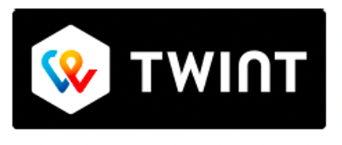
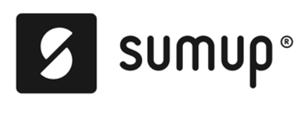

# 🧊 The Fridge Experiment

Mit diesem Projekt möchte ich meinen Kolleginnen und Kollegen ermöglichen, jederzeit unkompliziert Getränke direkt im
Büro zu fairen Preisen zu kaufen – ganz ohne den Weg zum nächsten Laden.  
Die Bezahlung und das Nachfüllen übernehme ich selbst. So entsteht eine praktische Lösung, um den Büroalltag angenehmer
zu machen und spontan für Erfrischung zu sorgen.

---

## 🏷️ Aktuelle Preisliste

| Getränk             | Preis (CHF) |
|---------------------|-------------|
| El Tony Mate        | 1.90        |
| Monster White       | 1.70        |
| Red Bull Fuji Apfel | 1.70        |
| Red Bull            | 1.50        |
| Red Bull Zero       | 1.50        |
| Guaraná             | 1.30        |
| Schnitzwasser       | 1.00        |

---

## 👤 Wer steckt dahinter?

## ❓ FAQ

### 🔹 Wie funktioniert es?

1. Wunschgetränk aus dem Kühlschrank nehmen.
2. Den angeschriebenen Preis via **TWINT** oder **SumUp** per QR-Code bezahlen.
3. Geniessen. 🙂

### 🔹 Kann ich mir Getränke wünschen?

Gerne! Melde dich persönlich oder per  
📧 [Mail](mailto:gabriel@nadolny.dev)

### 🔹 Kann ich auch bar bezahlen?

**TWINT** und **SumUp** ist für mich organisatorisch am einfachsten – daher ist es das einzige akzeptierte Zahlungsmittel.  
Danke für dein Verständnis!

### 🔹 Wie zahle ich mit TWINT?

TWINT ist eine Schweizer Mobile-Payment-App.

Du bezahlst, indem du den QR-Code am Kühlschrank mit der TWINT-App scannst.

Danach bestätigst du den Betrag auf deinem Smartphone – und die Zahlung ist sofort erledigt.

### 🔹 Was zahle ich mit SumUp

Am Kühlschrank findest du einen QR-Code von SumUp zum Scannen.

Du öffnest den Link auf deinem Smartphone, gibst Kartendaten ein oder bezahlst mit Apple Pay / Google Pay.

Nach der Bestätigung ist die Zahlung abgeschlossen und du kannst dein Getränk mitnehmen.

---

## 💬 Feedback zum Projekt

Ich freue mich über jedes Feedback – melde dich gerne persönlich oder per  
📧 [Mail](mailto:gabriel@nadolny.dev)
